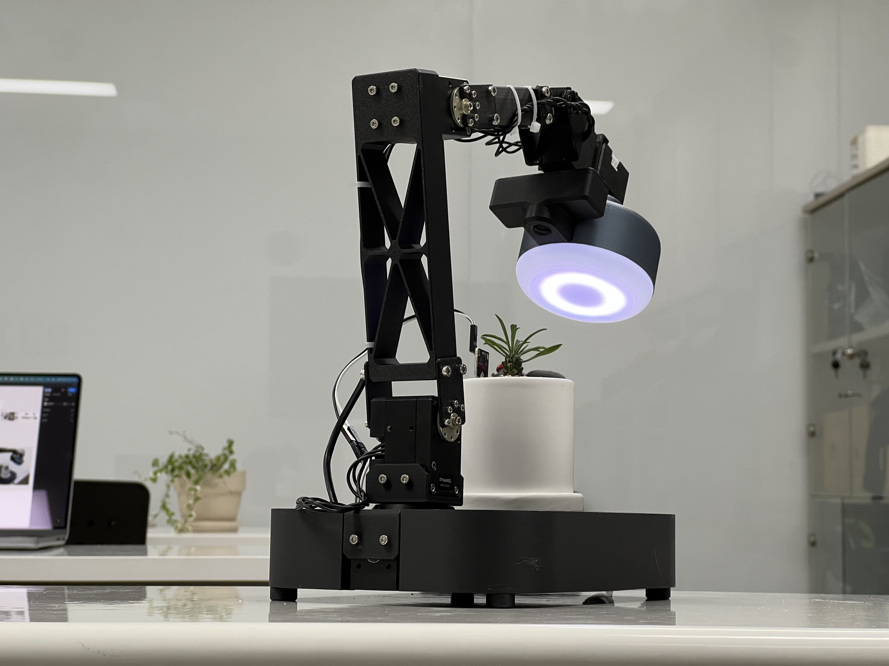

# OpenRB NeoPixel Controller

A DYNAMIXEL slave device implementation for the OpenRB-150 board that controls NeoPixel LED strips through DYNAMIXEL protocol commands.



## Overview

This project implements a DYNAMIXEL slave device on the OpenRB-150 board that allows remote control of NeoPixel LED strips. The device acts as a bridge between DYNAMIXEL protocol commands and NeoPixel control, enabling you to control RGB LED strips from any DYNAMIXEL master device or software.

## Features

- **DYNAMIXEL Protocol 2.0 Support**: Compatible with DYNAMIXEL Protocol 2.0
- **NeoPixel Control**: Controls up to 16 NeoPixel LEDs (configurable)
- **RGB Control**: Individual control of Red, Green, and Blue values
- **Real-time Updates**: Immediate LED updates when control values change
- **OpenRB-150 Optimized**: Specifically designed for OpenRB-150 board
- **Cross-platform Compatibility**: Supports various Arduino boards with DYNAMIXEL Shield

## Hardware Requirements

### Required Components
- **OpenRB-150** board (primary target) or other supported Arduino boards
- **NeoPixel LED strip** (WS2812B or compatible)
- **Power supply** for NeoPixels (if using more than a few LEDs)

## Pin Configuration

### OpenRB-150
- **NeoPixel Data Pin**: Pin 2 (configurable)
- **DYNAMIXEL Communication**: Serial1 (DXL TTL port)
- **Debug Output**: Serial

## Installation

### Prerequisites
1. **Arduino IDE**
2. **Dynamixel2Arduino Library**
   - Install via Arduino Library Manager
   - Or download from: https://github.com/ROBOTIS-GIT/Dynamixel2Arduino
3. **Adafruit NeoPixel Library**
   - Install via Arduino Library Manager
   - Or download from: https://github.com/adafruit/Adafruit_NeoPixel

### Setup Instructions
1. Clone or download this repository
2. Open `openrb_neopixel.ino` in Arduino IDE
3. Select your board from the Tools menu
4. Configure the pin settings if needed (see Configuration section)
5. Upload the code to your board

## Configuration

### NeoPixel Settings
```cpp
#define PIN        2    // NeoPixel data pin
#define NUMPIXELS  16   // Number of NeoPixels
```

### DYNAMIXEL Settings
```cpp
const uint16_t DXL_MODEL_NUM = 0x5005;  // Device model number
dxl.setID(200);                         // Device ID (1-253)
```

### Control Table Addresses
- **Red Value**: Address 10
- **Green Value**: Address 11  
- **Blue Value**: Address 12

## Usage

### DYNAMIXEL Protocol Commands

The device responds to standard DYNAMIXEL Protocol 2.0 commands:

#### Write RGB Values
```
Write to Address 10: Red value (0-255)
Write to Address 11: Green value (0-255)
Write to Address 12: Blue value (0-255)
```

#### Read RGB Values
```
Read from Address 10: Current Red value
Read from Address 11: Current Green value
Read from Address 12: Current Blue value
```

### Example Control Sequence
1. Set Red value: Write 255 to address 10
2. Set Green value: Write 128 to address 11
3. Set Blue value: Write 64 to address 12
4. All NeoPixels will immediately update to the new color

## Communication Parameters

- **Baud Rate**: 1mbps
- **Protocol Version**: 2.0
- **Device ID**: 200 (configurable)
- **Model Number**: 0x5005

## Dependencies

- **Dynamixel2Arduino**: DYNAMIXEL protocol implementation
- **Adafruit_NeoPixel**: NeoPixel LED control library

## License

This project is licensed under the Apache License, Version 2.0. See the [LICENSE](LICENSE) file for details.
